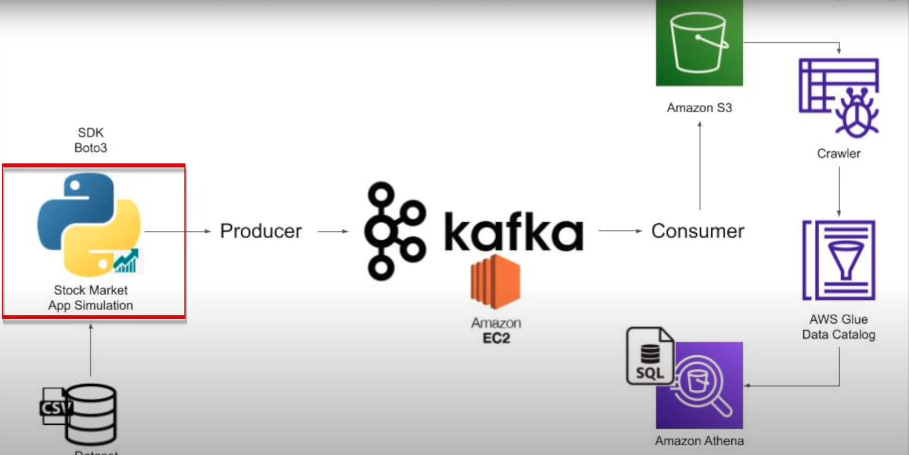

#End-To-End Data Engineering Project on Real-Time Stock Market Data using Kafka.

we  take some stock market data and use Python to produce that data and put that data onto 
Kafka cluster after that we will consume that data and store that data onto Amazon S3. 
crawl that data to build a Glue catalog and analyze that data using Amazon Athena using SQL .

##Tech Stack

Programming Language - Python,
Amazon Web Service (AWS),
S3 (Simple Storage Service),
Athena,
Glue Crawler,
Glue Catalog,
EC2,
Apache Kafka

followed Darshil's Youtube Tutorial:https://www.youtube.com/watch?v=KerNf0NANMo&ab_channel=DarshilParmar
